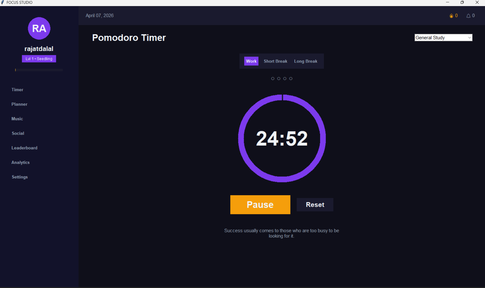
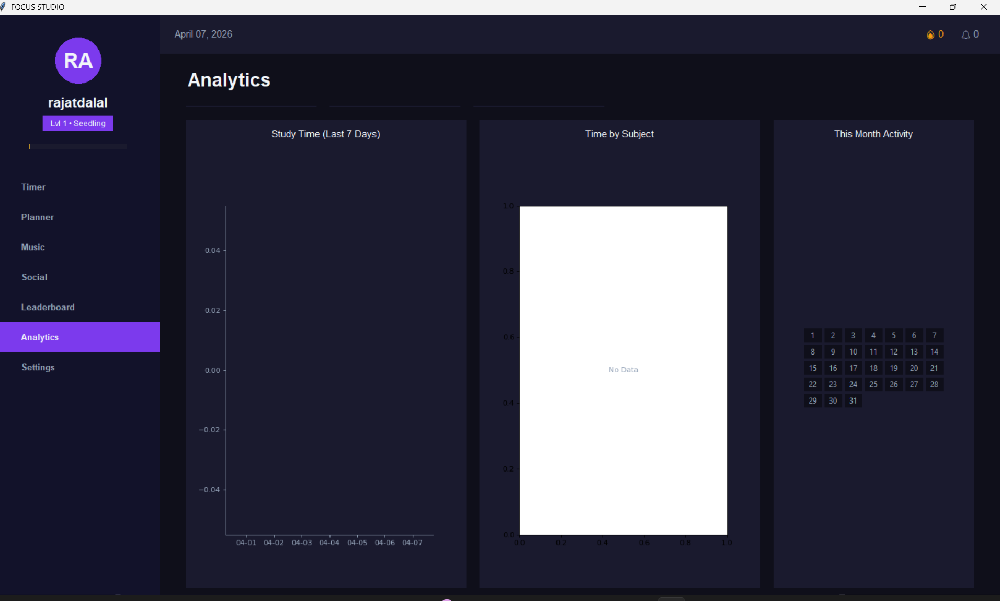
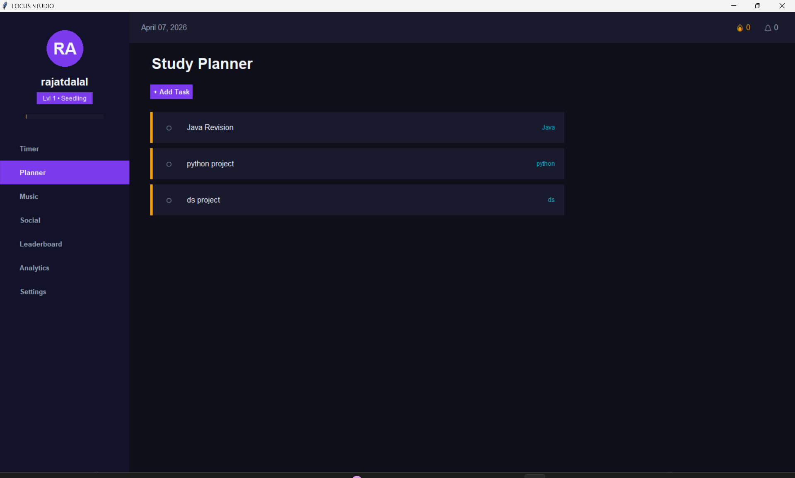
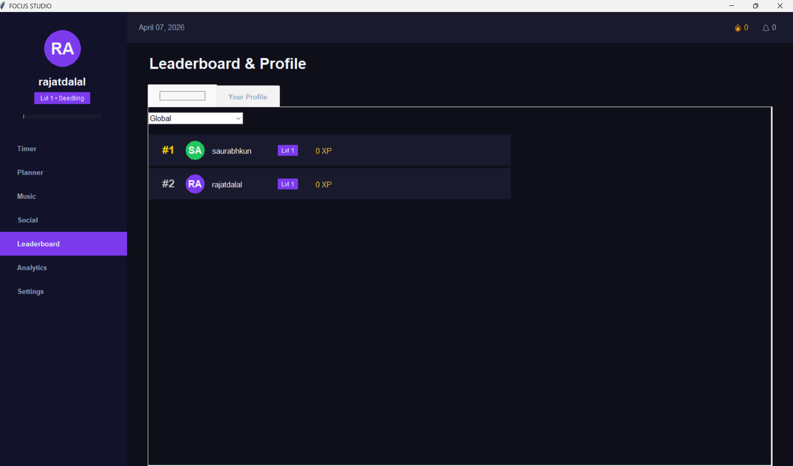
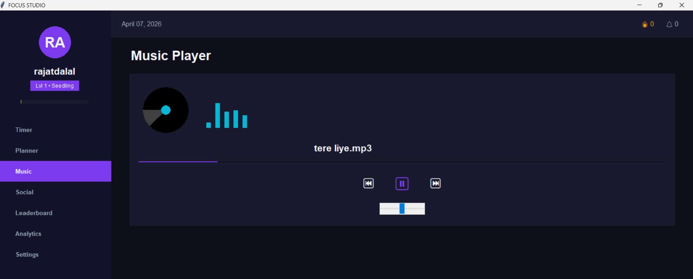
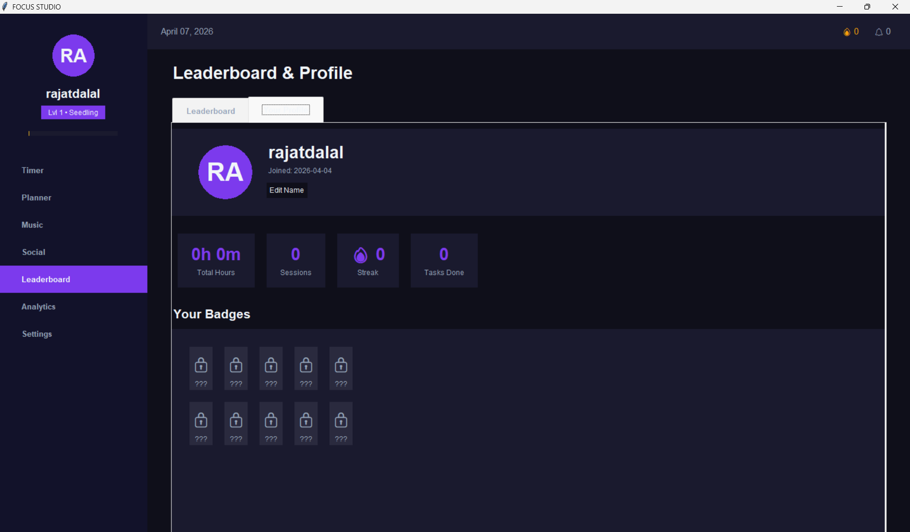

<div align="center">

# 🎯 FOCUS STUDIO

**Level up your productivity. Gamify your grind.**

[](https://www.python.org/)
[](https://docs.python.org/3/library/tkinter.html)
[](https://www.sqlite.org/)
[](https://github.com/)
[](https://github.com/)

> 🔥 **STOP SCROLLING. START GRINDING.** 🔥  
> Focus Studio isn't just another boring Pomodoro timer - it's a **high-octane, adrenaline-fueled Productivity RPG**.  
> Transform your study sessions into an interactive quest where **every second of hyper-focus earns raw XP, leaderboard domination, and academic supremacy!**

[**📸 Screenshots**](#-app-showcase) • [**✨ Features**](#-key-features) • [**🛠️ Architecture**](#️-project-architecture) • [**🚀 Quick Start**](#-installation--setup) • [**🔮 Roadmap**](#-future-improvements-roadmap)

</div>

---

## 📸 App Showcase

### ⏱️ Gamified Focus Timer - The Heart of the App

<div align="center">
  
</div>

> Real-time countdown timer with animated XP rewards. Every completed session levels you up!

---

### 📊 Deep Analytics - Track Your Progress

<div align="center">
  
</div>

> Visual bar graphs and charts show your daily and weekly focus hours — hold yourself accountable.

---

### 🗂️ More Features at a Glance

|            📅 Tactical Mission Planner             |                🏆 Global Leaderboard                 |
| :------------------------------------------------: | :--------------------------------------------------: |
|  |        |
|  Plan and schedule study blocks like a quest log   | Compete with friends based on total Focus Power & XP |

|           🎵 Integrated Focus Jukebox           |                 👤 User Profile & XP                  |
| :---------------------------------------------: | :---------------------------------------------------: |
|         |             |
| Built-in MP3 player to maintain your Flow State | Track your level, badges, streaks, and lifetime stats |

---

## ✨ Key Features

Transform the way you work and study with our suite of built-in tools.

| Feature                      | Description                                                                                      |
| :--------------------------- | :----------------------------------------------------------------------------------------------- |
| **⚔️ Quest Timer**           | Pomodoro-style clock that rewards you with XP. Level up as you master your focus.                |
| **📅 Mission Planner**       | Organize subjects and schedule study blocks like a tactical quest log.                           |
| **🎵 Integrated Jukebox**    | Built-in MP3 player to maintain "Flow State" without leaving the app.                            |
| **🏆 Global Leaderboards**   | Compare your "Focus Power" with friends and stay motivated through competition.                  |
| **📊 Deep Analytics**        | Visual charts to track your daily and weekly progress with session history.                      |
| **🛡️ 100% Offline**          | Your data stays on your machine in a secure local SQLite database. No cloud, no tracking.        |
| **🎖️ Badges & Achievements** | Unlock exclusive badges as you hit streak milestones and XP goals.                               |
| **🌙 Dark Mode UI**          | A sleek, custom dark-themed interface that is easy on the eyes during late-night grind sessions. |

---

## 🛠️ Project Architecture

We believe in clean code and separation of concerns.

```text
focus-studio/
├── run.py               <- Entry point. Run this to launch the app.
├── settings.json        <- Saves local user configuration dynamically.
├── focus_studio.db      <- Offline SQLite DB — stores XP, sessions & user data.
├── requirements.txt     <- All Python dependency packages.
├── run.spec             <- PyInstaller build config for .exe packaging.
├── PROJECT_REPORT.md    <- Formal academic write-up.
│
├── logic/               <- The Brain Layer (zero UI, pure logic)
│   ├── auth.py          <- Login, registration, and session management.
│   ├── database.py      <- SQLite CRUD operations engine.
│   ├── badges.py        <- XP calculation, leveling, and badge unlocking logic.
│   └── utils.py         <- Shared helper functions (parsers, formatters, etc.)
│
├── views/               <- The UI Layer (all Tkinter screens)
│   ├── main.py          <- App controller and window routing hub.
│   ├── timer.py         <- Gamified Pomodoro timer interface.
│   ├── analytics.py     <- Visual analytics graphs and charts.
│   ├── music.py         <- MP3 jukebox UI with background threading.
│   ├── planner.py       <- Study block and mission planner UI.
│   ├── social.py        <- Friends and social hub interface.
│   ├── leaderboard.py   <- User rankings based on Focus Power.
│   └── settings.py      <- App preference and settings screen.
│
├── styles/              <- The Styling Layer
│   └── theme.py         <- Centralized: all hex colors, fonts, dark mode tokens.
│
└── assets/              <- Screenshots and image resources.
```

---

## 🎨 UI Color Palette

Clean and highly energetic design system - built for maximum focus with minimal eye strain.

| Color Preview | Role                    | Hex Value |
| :-----------: | :---------------------- | :-------: |
|      ⚫       | Background              | `#0F0F1A` |
|      🌑       | Cards / Panels          | `#1A1A2E` |
|      🟣       | Accent Purple (Primary) | `#7C3AED` |
|      🔵       | Accent Cyan (Secondary) | `#06B6D4` |
|      🟢       | Success / Buy           | `#22C55E` |
|      🔴       | Danger / Sell           | `#EF4444` |
|      🟡       | XP / Gold Rewards       | `#FBBF24` |
|      ⚪       | Text Primary            | `#F1F5F9` |
|      🔘       | Text Secondary          | `#94A3B8` |

---

## 🚀 Installation & Setup

### Prerequisites

Ensure you have **Python 3.11 or higher** installed on your system.

### Quick Start

```bash
# 1. Clone the repository
git clone https://github.com/yourusername/focus-studio.git
cd focus-studio

# 2. Install all dependencies
pip install -r requirements.txt

# 3. Launch the application
python run.py
```

> **Note:** No internet connection is required after setup. The app runs 100% offline.

---

## 🔮 Future Improvements Roadmap

We are constantly improving the system. Community PRs are welcome!

- [ ] ☁️ Cloud sync for cross-device XP and progression
- [ ] 🎨 Advanced visual themes and custom avatar unlockables
- [ ] 👥 Multi-player party study rooms with real-time sync
- [ ] 🌐 Web dashboard companion app for browser-based tracking
- [ ] 🤖 AI-powered study habit recommendations
- [ ] 🔔 Desktop notification support for break reminders
- [ ] 📱 Mobile app version (Android / iOS)

---

## 💡 Why Focus Studio?

Most study apps are **clinical and boring**. Focus Studio bridges the gap between _"needing to work"_ and _"wanting to progress."_

- 🔒 **100% Private** - no accounts, no cloud, no data collection. Everything lives on your machine.
- 🎮 **Gamified** - XP, levels, and leaderboards make grinding actually fun.
- 🎨 **Beautiful UI** - a custom dark aesthetic designed to feel premium, not like a school tool.
- ⚡ **Lightweight** - built with Python + Tkinter. No Electron bloat. Starts instantly.

---

<div align="center">

_Built with ❤️ by **Saurabh Gandhi** | **SY ECM 18** | WIT Solapur_

**[⬆ Back to Top](#-focus-studio)**

</div>
